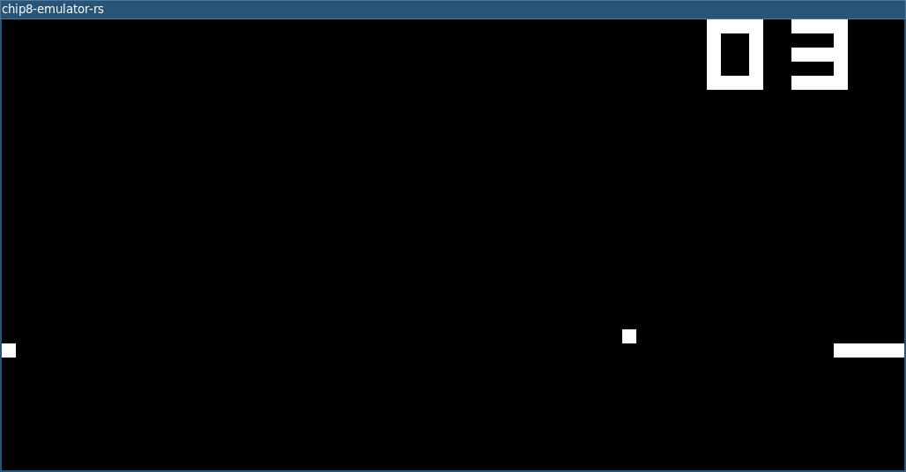

# chip8-emulator-rs
Rust port of the newer `chip8-emulator-python` project layout and core emulator behavior. Work on this project started on 2023-10-31 (initial commit).



## Project Layout
- `src/chip8_emulator/`: emulator source code
- `assets/`: runtime assets
- `roms/`: CHIP-8 ROMs
- `programs/`: assembly source programs
- `dumps/`: memory dumps and debug output
- `scripts/`: helper scripts
- `tests/`: Rust integration tests

### Source Modules
- `config.rs`: constants
- `quirks.rs`: quirk profiles and loading
- `state.rs`: emulator state + memory/input helpers
- `cpu.rs`: opcode decode/execute and CPU cycle logic
- `app.rs`: headless + raylib window runtime loop
- `main.rs`: CLI entrypoint
- `src/assembler/`: assembler parser/encoder modules
- `src/bin/chip8-asm.rs`: assembler CLI entrypoint

## Run
```bash
cargo run -- --headless --rom roms/chip8-test-suite.ch8 --hz 700 --max-cycles 2000
```

Windowed (raylib):
```bash
cargo run -- --rom roms/chip8-test-suite.ch8 --scale 16 --hz 700 --fps 60
```

Quirk profiles:
```bash
cargo run -- --headless --quirks original --rom roms/chip8-test-suite.ch8
cargo run -- --headless --quirks modern --rom roms/chip8-test-suite.ch8
```

Assemble ROMs:
```bash
cargo run --bin chip8-asm -- programs/white_dot_wasd.asm -o roms/white_dot_wasd.ch8
cargo run --bin chip8-asm -- programs/snake.asm -o roms/snake.ch8
```

## Test
```bash
cargo test
```

## Port Status
- Ported: config, state management, quirk profiles, core opcode execution, headless loop, raylib windowed runtime, assembler package, compliance tests.
- Not yet ported: audio beep playback and full parity with Python helper scripts.
